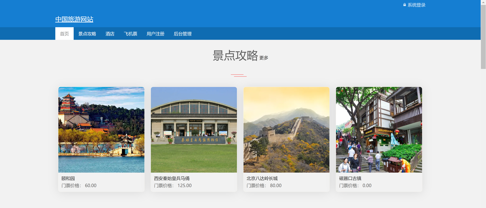
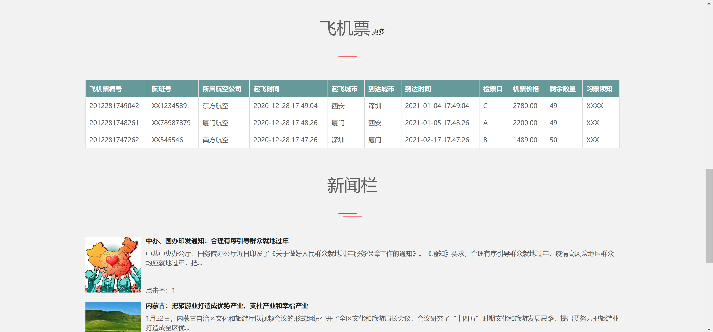
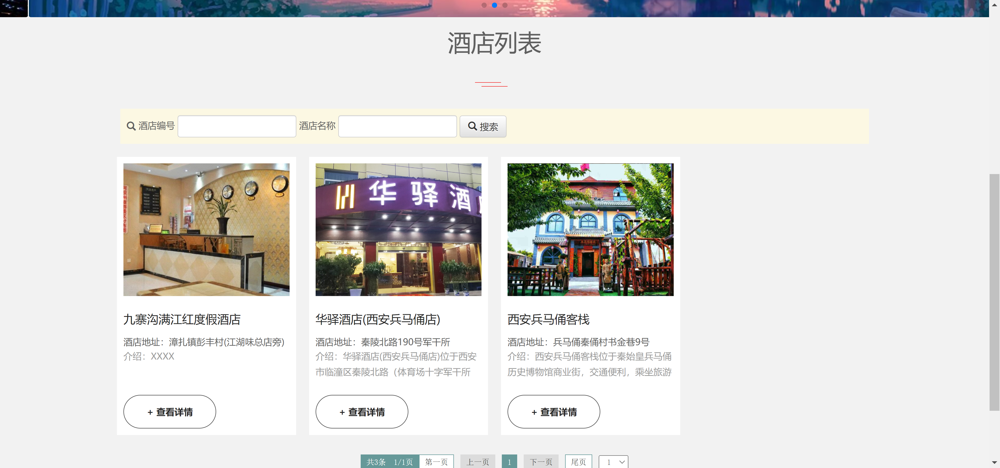
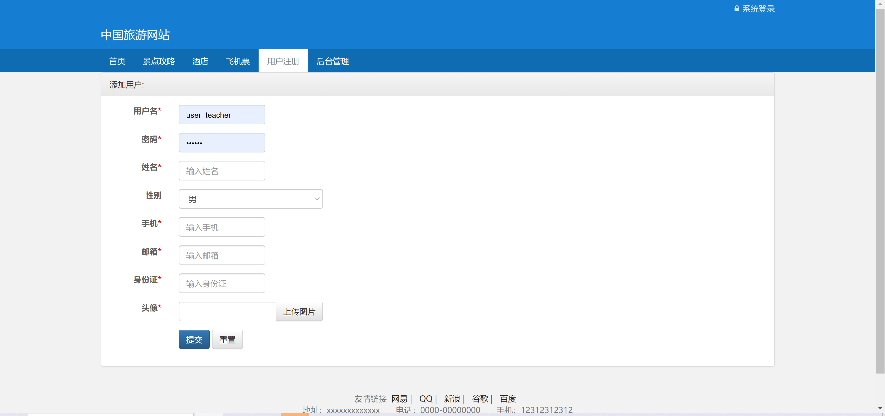
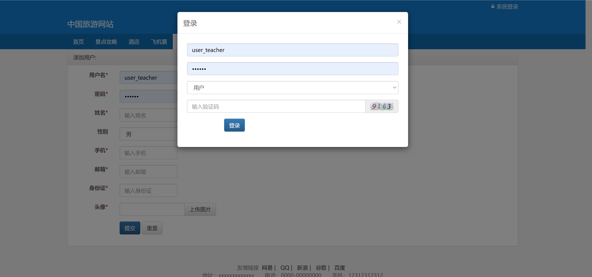
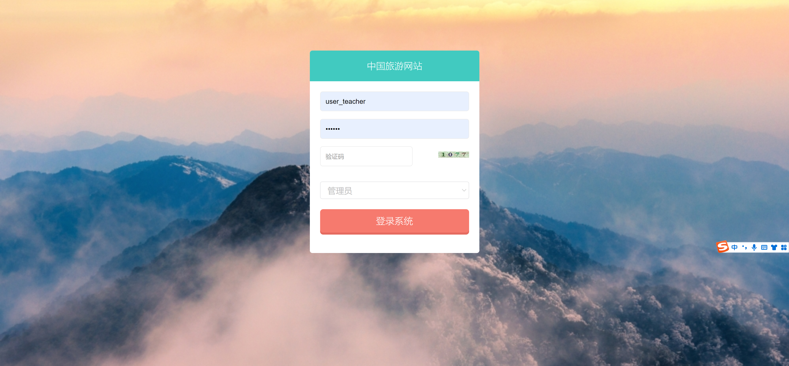
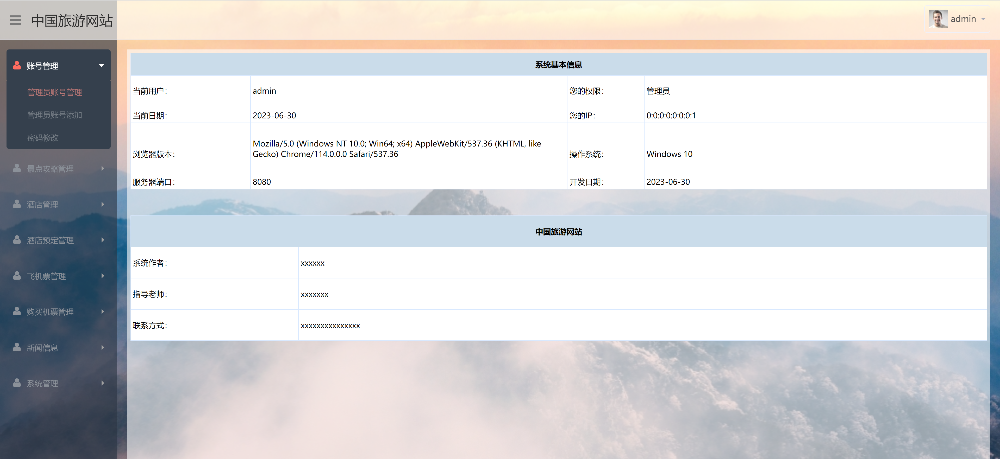
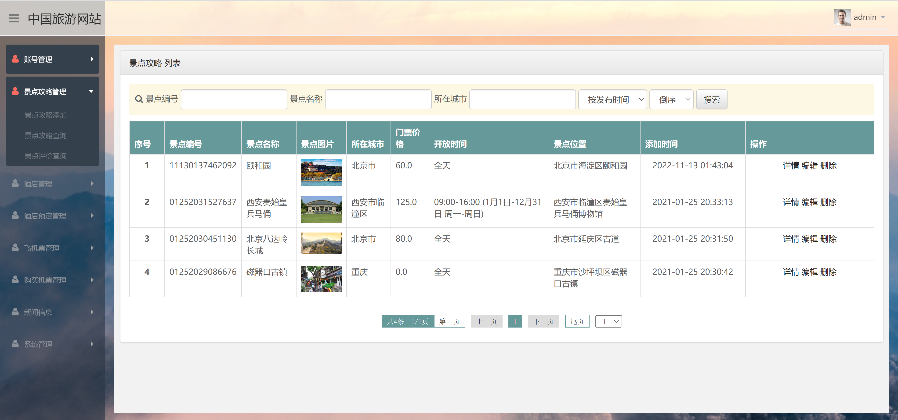

<h1 align="center">中国旅游网站管理系统</h1>

## 简介
中国旅游网站管理系统：角色分为管理员、用户；功能包括机票信息管理、新闻资讯发布、用户注册与登录、景点攻略与酒店管理、在线预订及评论功能。    --计算机毕业设计源码；毕设源码；java毕业设计源码

## 联系方式

<h3 align="center">获取完整代码与数据库文件 + 微信：bysj5151 QQ: 86050149 QQ群: 783742310</h3>

<h3 align="center">可帮忙远程部署 包运行成功！提供远程部署、修改代码、设计文档指导、代码讲解等服务！</h3>

## 功能介绍（完整见运行截图）
管理员：主要负责系统的整体管理，包括用户管理、酒店管理、机票管理、景点攻略管理和新闻信息发布。管理员可通过登录页面进行身份验证进入系统，并运用景点攻略列表、酒店列表、机票信息等后台模块进行详细信息的维护、编辑和管理。此外，管理员还可查看系统基本信息及操作日志，确保系统的高效运作和安全性。  
用户：用户通过该系统能够实现旅游一站式服务，包括机票购票、酒店预订和景点攻略查询等功能。用户需通过注册和登录功能创建并管理个人账户信息，之后可以利用系统的搜索功能来快速查找并预订旅游相关服务。用户还可以在平台上分享旅行体验，查看推荐景点和旅游资讯，获取旅游灵感和信息。

## 运行截图

本代码来源于网络,仅供学习参考使用!

